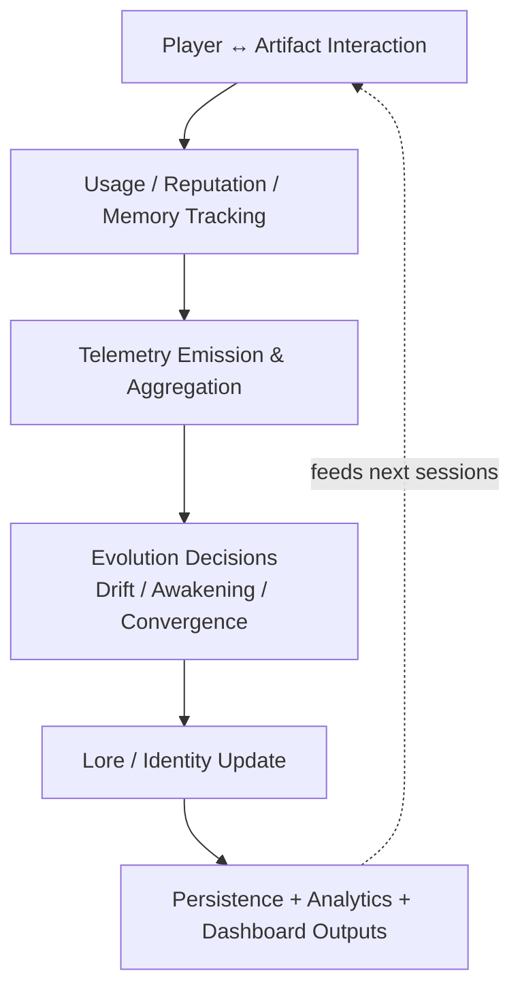

# ObtuseLoot

**ObtuseLoot** is a pre-release Paper/Purpur plugin for **persistent, identity-driven equipment progression**.
Instead of handing out disposable rarity upgrades, it tracks how artifacts are used over time and lets their behavior evolve through the live convergence pipeline.

For server owners, the value is simple: player gear can become long-lived and consequential, while you still keep operational control through telemetry, safety guardrails, and configurable persistence.

> Current branch status: **0.9.50-beta** (pre-release).

---

## At a glance: how it behaves in practice

1. A player acquires an artifact.
2. The plugin tracks usage and reputation signals tied to that artifact identity.
3. Progression systems adjust outcomes over time, including awakening and convergence transitions.
4. Ecosystem pressure and safety checks monitor distribution drift.
5. Telemetry rollups and dashboards give admins a runtime view of what is happening.

The result is progression that is **stateful and observable**, rather than a static rarity table.

---

## Runtime Flow Overview



ObtuseLoot runs as a behavior-driven loop: how players actually use artifacts updates memory and reputation, telemetry captures those signals, and the system applies drift, awakening, and convergence decisions before updating artifact lore/identity. Those results are then persisted and surfaced through analytics and dashboards, feeding the next round of gameplay instead of relying on a static loot table.

---

## What makes ObtuseLoot distinct

- **Artifact identity and memory**: items are treated as long-lived entities, not one-off rolls.
- **Reputation-driven evolution**: player behavior influences archetype outcomes.
- **Awakening + convergence pipeline**: major identity shifts follow the current runtime systems.
- **Ecosystem balancing + safety guards**: pressure signals and dumps help prevent unhealthy loot distribution.
- **Telemetry-first operations**: logs, rollups, and dashboards are built into normal runtime behavior.

This repository also includes offline simulation and analytics tooling under `simulation/` and `scripts/`.

---

## Runtime architecture (current codebase)

At startup (`obtuseloot.ObtuseLoot`), the plugin initializes in this order:

1. Runtime config and tuning
2. Telemetry pipeline (archive, rollup snapshot store, rehydration)
3. Persistence backend (`yaml`, `sqlite`, or `mysql`)
4. Engine components (artifact, reputation, ecosystem, lineage, abilities, lore)
5. Dashboard service/web server
6. Command layer (`/obtuseloot`, `/ol`)
7. Periodic tasks for environment pressure and telemetry flushing

Core composition is split under `src/main/java/obtuseloot/bootstrap/`:

- `TelemetryBootstrap`
- `PersistenceBootstrap`
- `EngineBootstrap`
- `DashboardBootstrap`
- `CommandBootstrap`
- `PluginPathLayout` (centralized runtime output paths)

---

## Runtime + persistence behavior

Persistence is configured in `config.yml`:

- `storage.backend: yaml` — file-backed player state (default)
- `storage.backend: sqlite` — embedded DB file
- `storage.backend: mysql` — external DB for larger/shared environments

Fallback behavior is controlled by `storage.fallbackToYamlOnFailure`.

---

## Analytics, dashboards, and path ownership

Runtime analytics/report output is centralized through `paths.analyticsRoot` in `config.yml`.

- Default root: `plugins/ObtuseLoot/analytics`
- Telemetry, dashboards, and safety/report artifacts resolve under that root unless explicitly externalized.

Examples:

- `plugins/ObtuseLoot/analytics/telemetry/ecosystem-events.log`
- `plugins/ObtuseLoot/analytics/telemetry/rollup-snapshot.properties`
- `plugins/ObtuseLoot/analytics/dashboard/ecosystem-dashboard.html`
- `plugins/ObtuseLoot/analytics/safety/ecosystem-safety-dump.json`

---

## Commands and documentation

The command surface includes admin, debug, ecosystem, and artifact controls.

See:

- [`commands and permissions.md`](./commands%20and%20permissions.md)

---

## Build and install

### Requirements

- Java **21**
- Maven **3.9+**
- Paper/Purpur **1.21 API line**

### Standard build (tests enabled by default)

```bash
mvn -B -ntp clean package
```

Output jar:

```text
target/ObtuseLoot-0.9.50-beta.jar
```

### Optional fast local build (explicit test skip)

```bash
mvn -B -ntp -Pfast clean package
```

### Server install

1. Build the jar.
2. Copy it to your server `plugins/` directory.
3. Start or restart the server.
4. Review generated `plugins/ObtuseLoot/config.yml` and tune storage/runtime settings.

---

## Operational notes

- This is a **beta** plugin; expect tuning and report schema drift between versions.
- If dashboard web serving is enabled, treat it as an internal admin endpoint.
- Validate config changes with ecosystem diagnostics (`/obtuseloot ecosystem ...`) before production rollout.

---

## License

See [`LICENSE`](./LICENSE).
