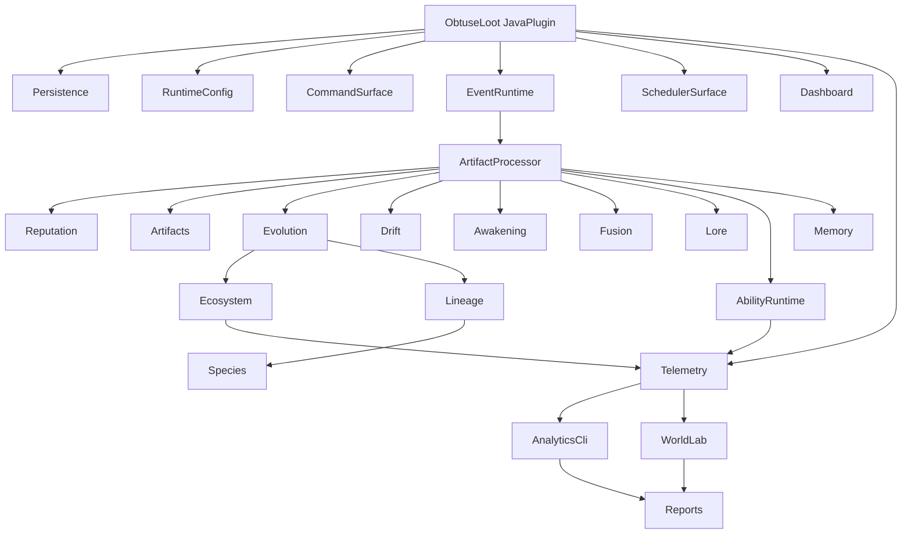
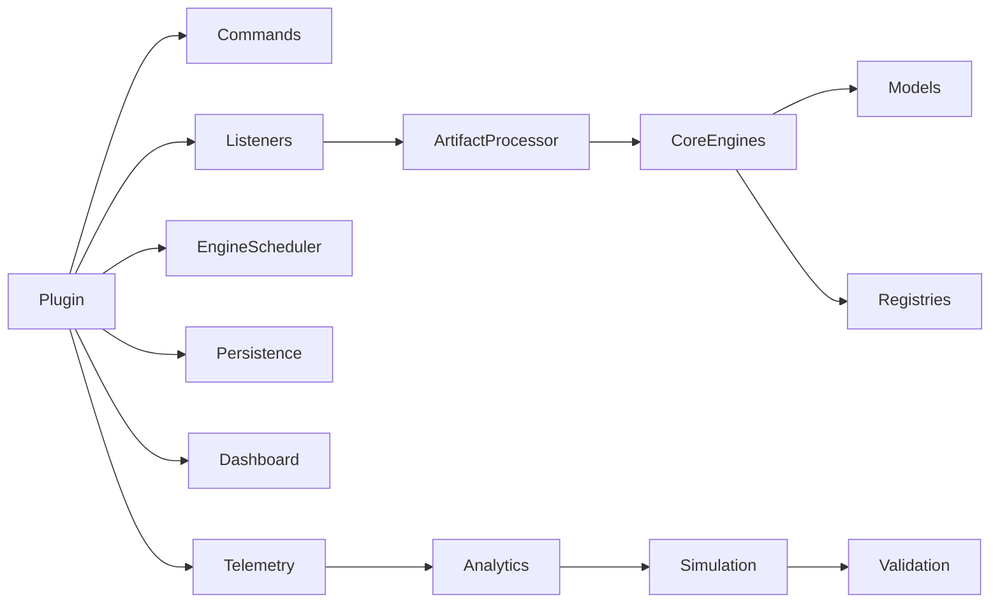
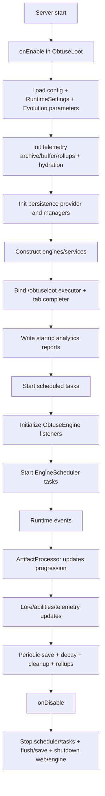
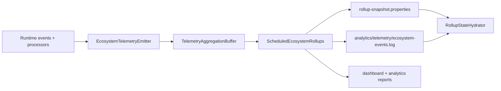
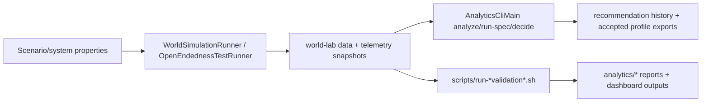

# ObtuseLoot

## Overview
ObtuseLoot is a Java 21 Minecraft plugin (Purpur/Bukkit API target `1.21`) focused on persistent, behavior-driven artifact progression, with evolution, drift, awakening, fusion, memory, lineage/species modeling, and telemetry-backed ecosystem analytics.

The repository also contains an extensive offline analytics + simulation toolchain (world-lab, open-endedness experiments, CLI analyzers, validation harness scripts) that is built and executed through Maven-based workflows.

## Current Status
- **Version in source:** `0.9.7` (`pom.xml` + `plugin.yml`).
- **Packaging:** Single-module Maven `jar` project (no multi-module reactor).
- **Runtime target:** Purpur API `1.21.1-R0.1-SNAPSHOT`.
- **Maturity profile:** Active runtime plugin with large analytics/experiment surface and substantial test coverage under `src/test/java`.

## Core Features
- Persistent per-player artifact state and reputation.
- Multi-axis progression engine (`precision`, `brutality`, `survival`, `mobility`, `chaos`, `consistency`, kill/boss-chain signals).
- Evolution + niche/ecology-informed fitness scoring.
- Drift, awakening, fusion, lore, and memory systems.
- Ability runtime with trigger subscriptions, projection matrices, and non-combat trigger listeners.
- Telemetry archive + rollup pipeline with replay/hydration.
- Ecosystem dashboard generation and optional embedded web server.
- Offline simulation/analytics runners and validation pipelines.

## Architecture
ObtuseLoot is organized as one plugin runtime plus adjacent analysis/simulation subsystems.

### High-level subsystem map


### Subsystem dependency view


### Subsystems (fingerprinted from code)
- **Plugin bootstrap:** `obtuseloot.ObtuseLoot`.
- **Command system:** `commands` package (`ObtuseLootCommand`, `DebugCommand`, `DashboardCommandExecutor`, completers).
- **Event/listener runtime:** `obtuseengine.ObtuseEngine` + listener classes in `combat` and `events`.
- **Core progression engines:** `evolution`, `drift`, `awakening`, `fusion`, `lore`, `memory`.
- **Artifact and reputation core:** `artifacts`, `reputation`, `combat`.
- **Ability execution system:** `abilities` (+ genome/projection/trigger budgeting and indexing).
- **Ecology/lineage/species systems:** `ecosystem`, `lineage`, `species`.
- **Telemetry + rollups:** `telemetry` package.
- **Dashboard subsystem:** `dashboard` package and analytics output writers.
- **Persistence subsystem:** `persistence` package (YAML/SQLite/MySQL providers + migration).
- **Simulation + analytics tooling:** `simulation/worldlab`, `analytics/*`, `scripts/*`, CLI mains in `analytics/ecosystem`.

## Execution Flow


## Repository Structure
```text
.
├── pom.xml
├── src/
│   ├── main/java/obtuseloot/
│   │   ├── ObtuseLoot.java
│   │   ├── commands/            # command executors + completers
│   │   ├── obtuseengine/        # listener wiring + scheduler
│   │   ├── events/ combat/      # listeners/event ingestion
│   │   ├── artifacts/ reputation/ persistence/
│   │   ├── evolution/ ecosystem/ lineage/ species/
│   │   ├── abilities/ telemetry/ dashboard/ simulation/
│   │   └── ...
│   ├── main/resources/
│   │   ├── plugin.yml
│   │   └── config.yml
│   └── test/java/obtuseloot/    # architecture, engine, analytics, telemetry tests
├── scripts/                     # Maven-based build/sim/validation helpers
├── analytics/                   # generated reports, datasets, visualizations
├── simulation/                  # scenario/readme folders
├── docs/                        # audits and operational documents
├── releases/                    # release notes packages
└── .github/workflows/           # CI/benchmark/world-lab/release pipelines
```

## Requirements
- JDK **21+**
- Maven **3.9+** recommended
- Purpur/Bukkit-compatible server for plugin runtime

## Installation
1. Build the plugin jar with Maven.
2. Copy `target/ObtuseLoot-<version>.jar` to your server `plugins/` directory.
3. Start server once to generate/update `plugins/ObtuseLoot/config.yml`.

## Build (Maven)
```bash
mvn clean package
```

Alternative helper script:
```bash
./scripts/build.sh
```

## Running / Deployment
- **Plugin runtime:** deploy built jar to server `plugins/` and start server.
- **Dashboard web server:** disabled by default; enable via `dashboard.webServerEnabled` in config.
- **Offline simulation runner:**
  ```bash
  mvn -DskipTests -Dexec.mainClass=obtuseloot.simulation.worldlab.WorldSimulationRunner -Dexec.classpathScope=compile org.codehaus.mojo:exec-maven-plugin:3.5.0:java
  ```
- **Ecosystem analytics CLI main:**
  ```bash
  mvn -DskipTests -Dexec.mainClass=obtuseloot.analytics.ecosystem.AnalyticsCliMain -Dexec.classpathScope=compile org.codehaus.mojo:exec-maven-plugin:3.5.0:java -Dexec.args="analyze --dataset <path> --output <path>"
  ```

## Configuration
Primary runtime config is `src/main/resources/config.yml` (copied to plugin data folder). Major sections:

- `storage`, `sqlite`, `mysql`, `persistence`
- `reputation`, `evolution`, `drift`, `combat`
- `runtime` (feature toggles such as trigger subscription indexing and active artifact cache)
- `dashboard`
- `analytics.ecology.*`
- `ecosystem.parameters.*` (includes telemetry flush/rollup/rehydration tuning)

## Commands and Permissions

### Command Surface (verified)
| Command | Aliases | Description | Usage | Permission | Notes |
|---|---|---|---|---|---|
| `/obtuseloot` | `ol` | Root admin/debug command | multi-line in `plugin.yml` | mixed (subcommand-dependent) | Registered in `plugin.yml`; executor/tab completer set in `onEnable`. |
| `help` | - | Show command list | `/obtuseloot help` | `obtuseloot.help` | - |
| `info` | - | Runtime status | `/obtuseloot info` | `obtuseloot.info` | - |
| `inspect` | - | Inspect player artifact state | `/obtuseloot inspect [player]` | `obtuseloot.inspect` | - |
| `refresh` | - | Regenerate player artifact profile | `/obtuseloot refresh [player]` | `obtuseloot.admin` | - |
| `reset` | - | Clear tracked state | `/obtuseloot reset [player]` | `obtuseloot.admin` | - |
| `reload` | - | Reload config/runtime snapshots | `/obtuseloot reload` | `obtuseloot.admin` | - |
| `dashboard` | - | Ecosystem health/dashboard summary | `/obtuseloot dashboard` | `obtuseloot.info` | Routed through `DashboardCommandExecutor`. |
| `ecosystem` | - | Dashboard/health/map/environment operations | `/obtuseloot ecosystem ...` | `obtuseloot.info` | Includes `environment`, `map`, and dashboard forms. |
| `addname` | - | Add entry to name pool | `/obtuseloot addname <pool> <value>` | `obtuseloot.edit` or scoped node | Scoped checks: `obtuseloot.edit.<pool>`. |
| `removename` | - | Remove entry from name pool | `/obtuseloot removename <pool> <value>` | `obtuseloot.edit` or scoped node | Scoped checks: `obtuseloot.edit.<pool>`. |
| `debug ...` | - | Debug/admin surface | `/obtuseloot debug <subcommand>` | `obtuseloot.debug` | Includes inspect/rep/evolve/drift/awaken/fuse/lore/reset/save/reload/instability/archetype/path/seed/simulate/ability/memory/persistence/ecosystem/lineage/genome/projection/subscriptions/artifact. |

### Permission Surface
| Permission Node | Description | Default | Notes |
|---|---|---|---|
| `obtuseloot.help` | Allows `/obtuseloot help` | `true` | Declared in `plugin.yml`. |
| `obtuseloot.info` | Allows `/obtuseloot info` | `op`? no: `true` | Declared in `plugin.yml`; also gates dashboard/ecosystem root commands in code. |
| `obtuseloot.inspect` | Allows inspect | `op` | Declared in `plugin.yml`. |
| `obtuseloot.admin` | Allows refresh/reset/reload | `op` | Declared in `plugin.yml`. |
| `obtuseloot.edit` | Allows add/remove name | `op` | Declared in `plugin.yml`; code also supports scoped edit permissions. |
| `obtuseloot.debug` | Allows debug surface | `op` | Declared in `plugin.yml`; enforced in debug executor paths. |
| `obtuseloot.edit.prefixes` / `.suffixes` | Scoped pool editing | not specified | **Checked in code but not declared in `plugin.yml`.** |

### Descriptor ↔ Code inconsistencies
- `plugin.yml` usage text does not enumerate all implemented debug subcommands (`subscriptions`, `artifact/storage` etc.).
- `plugin.yml` usage shows many debug forms, but code currently includes additional runtime-only variants.
- Scoped permission nodes (`obtuseloot.edit.<pool>`) are code-checked but not declared in descriptor.

## Listener and Runtime Surface

### Registered listeners (verified runtime wiring)
| Listener/Class | Registered From | Purpose | Notes |
|---|---|---|---|
| `ReputationFeedListener` | `ObtuseEngine.initialize()` | Ingest combat/movement/kill-style reputation signals | Registered at plugin startup. |
| `CombatCore` | `ObtuseEngine.initialize()` | Combat event forwarding into processing path | - |
| `EventCore` | `ObtuseEngine.initialize()` | Kill/death path hooks and progression updates | - |
| `PlayerJoinLoadListener` | `ObtuseEngine.initialize()` | Load/cache player progression state on join | - |
| `PlayerStateCleanupListener` | `ObtuseEngine.initialize()` | Save/unload player state on disconnect | - |
| `ArtifactItemStorageListener` | `ObtuseEngine.initialize()` | Artifact item metadata/storage synchronization | - |
| `NonCombatAbilityListener` | `ObtuseEngine.initialize()` | Non-combat trigger dispatch (movement/chunk/context/etc.) | Includes coalesced trigger scheduling internally. |

### Scheduled/runtime tasks (verified)
| Task/Method | Registered From | Trigger/Frequency | Purpose | Notes |
|---|---|---|---|---|
| Environment pressure periodic update | `ObtuseLoot.onEnable()` | every `24,000` ticks | Advances seasons and rewrites `analytics/environment-pressure-report.md` | Bukkit sync repeating task. |
| Telemetry flush/rollup tick | `ObtuseLoot.onEnable()` | `telemetryFlushIntervalTicks` from config | Flush telemetry aggregation pipeline | Async repeating task via `TelemetryFlushScheduler`. |
| Autosave task | `EngineScheduler.startAutosaveTask()` | `autosaveIntervalSeconds * 20` | Save artifact + reputation stores | Started by `engineScheduler.startAll()`. |
| Reputation volatile decay task | `EngineScheduler.startDecayTask()` | `volatileDecayIntervalSeconds * 20` | Decay volatile stats + soft floor | - |
| Combat context cleanup task | `EngineScheduler.startCombatCleanupTask()` | `contextCleanupSeconds * 20` | Remove stale combat contexts | - |
| Instability cleanup task | `EngineScheduler.startInstabilityCleanupTask()` | every `100` ticks | Clear expired instability and mark artifacts dirty | - |
| Ecosystem map render loop (per-player) | `EcosystemMapRenderer.start(...)` | every `60` ticks after initial 1 tick | Push periodic map visualization updates | Started only by command-driven map session. |

## Analytics and Simulation

### Runtime telemetry and analytics flow


### Offline pipeline flow


### Tooling entrypoints
- **CLI main:** `obtuseloot.analytics.ecosystem.AnalyticsCliMain`
  - commands: `analyze`, `run-spec`, `decide`, `export-accepted`
- **Simulation mains:**
  - `obtuseloot.simulation.worldlab.WorldSimulationRunner`
  - `obtuseloot.simulation.worldlab.OpenEndednessTestRunner`
- **Other CLI/export mains:**
  - `obtuseloot.analytics.VisualizationExporter`
  - `obtuseloot.analytics.performance.TraitScoringBenchmarkMain`
- **Operational scripts:** `scripts/run-world-simulation.sh`, `scripts/run-open-endedness-test.sh`, `scripts/run-validation-suite-rerun.sh`, `scripts/run-world-lab-validation.sh`, and related helpers.

## Development Notes
- Build and test with Maven only.
- `maven-enforcer-plugin` requires Java 21+.
- Purpur API dependency is `provided`; plugin jar should not shade server APIs.
- Repository contains both source and significant generated analytics artifacts under `analytics/`.

### Circular dependency and coupling observations (evidence-based)
- `ArtifactProcessor` orchestrates many subsystems directly (evolution, drift, awakening, fusion, lore, memory, ability, telemetry via managers), making it a high-coupling integration hub.
- `ObtuseLoot` bootstrap constructs and stores many subsystem singletons, then exposes broad getters; this centralizes wiring but increases global coupling.
- No hard compile-time cyclic package import loop was confirmed from a static scan, but there is strong runtime bidirectional influence among evolution ↔ ecosystem ↔ telemetry signals.

## Contributor Onboarding
1. **Build:** `mvn clean package`.
2. **Plugin entrypoint:** start at `src/main/java/obtuseloot/ObtuseLoot.java`.
3. **Command handling:** inspect `src/main/java/obtuseloot/commands/`.
4. **Listener wiring:** inspect `src/main/java/obtuseloot/obtuseengine/ObtuseEngine.java`.
5. **Scheduled tasks:** inspect `EngineScheduler` and task registration in `ObtuseLoot.onEnable()`.
6. **Core engine logic:** `artifacts`, `reputation`, `evolution`, `drift`, `awakening`, `fusion`, `lore`, `memory`, `abilities`.
7. **Analytics/simulation:** `src/main/java/obtuseloot/analytics`, `src/main/java/obtuseloot/simulation`, plus `scripts/` and `analytics/` output directories.

### Stable vs experimental (practical guidance)
- **Relatively stable runtime core:** bootstrap, command root, persistence providers, core progression path.
- **More experimental / research-heavy:** world-lab/open-endedness analysis layers, telemetry aggregation analytics, ecology balancing experiments and report-generation flows.

## Limitations / Caveats
- Permission descriptor does not fully enumerate scoped code-checked nodes (`obtuseloot.edit.<pool>`).
- Command usage text in descriptor lags behind all implemented debug subcommands.
- Analytics folders include generated data and historical reruns; not all artifacts are guaranteed to represent current runtime defaults.
- No Git tags were visible in the local clone during this audit.

## Releases
Release notes and build/QA docs are stored under `releases/` (e.g., `releases/v0.9.6/`).

## License
No explicit top-level LICENSE file was found in this repository snapshot.
